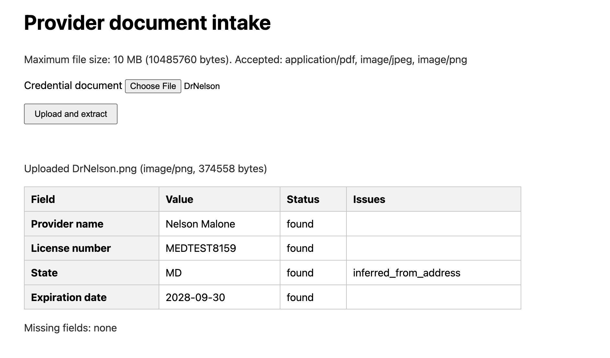

# Provider Document Intake

A small FastAPI service that reads a healthcare provider's credential document — a medical
licence, usually a photo or a scan — and pulls four fields out of it: **provider name, licence
number, issuing state, expiration date.**

The interesting part is not the extraction. It is what the service does when it *isn't sure*.



## The problem this solves

Credentialing teams receive licence documents as phone photos, scans and PDFs, and someone has to
type the details into a system. An LLM can read them — but an LLM will also confidently return a
date it half-guessed, or a licence number it inferred from a watermark. For credentialing, a
confident wrong answer is worse than no answer, because nobody knows to check it.

So every field comes back with a **status**, not just a value:

| status | meaning |
|---|---|
| `found` | read from the document and usable |
| `not_found` | the field is not in the document |
| `unreadable` | it is there but illegible — blurred, cropped, obscured |
| `invalid` | read correctly, but it does not pass validation (expired, unparseable date, unknown state) |

Plus `issues`, a list of short codes explaining *why*, and `missing_fields`, listing everything
that is not `found`. A human reviewer reads that list instead of re-checking all four fields.

Two rules hold throughout, and they are what make the output trustworthy:

- **`value` is `null` unless `status` is `found`.** A value attached to an uncertain field is
  dropped, never returned. The model cannot put a half-guess on the wire.
- **Validation may only lower confidence, never raise it.** The LLM's answer is untrusted input.
  Deterministic code afterwards can turn `found` into `invalid`, but nothing can promote a field
  the model was unsure about.

An expired licence therefore reads correctly and is still not usable — `status: invalid`, issue
`expired`, with the original date visible in `raw` so a human can see what the document said.

## Quick start

**Requirements:** Python 3.11+. [uv](https://docs.astral.sh/uv/) is preferred; pip works.

```bash
git clone https://github.com/shafiq-mohammed/provider-intake.git
cd provider-intake

uv venv && source .venv/bin/activate      # or: python -m venv .venv && source .venv/bin/activate
uv pip install -e '.[dev]'                # or: pip install -e '.[dev]'

python -m pytest -q                       # should pass, with no API key and no network
uvicorn app.asgi:app --reload
```

Open **http://127.0.0.1:8000**, choose a jpg, png or pdf, and press *Upload and extract*.

**No API key is needed to run this.** By default both the OCR and the extraction step use built-in
fakes, so the service starts, the page works and the whole test suite passes fully offline. That
is deliberate — the LLM sits behind a protocol precisely so nothing depends on a network call.
What you will see with the fakes is the plumbing, not real extraction: every field comes back
`not_found` with the issue `no_text`.

To read real documents, add a key.

## Adding your Anthropic API key

Get one from [console.anthropic.com](https://console.anthropic.com) — it is pay-as-you-go and
separate from a Claude.ai subscription. A few dollars covers a lot of documents; each one is two
API calls.

**Create a `.env` in the project root:**

```bash
ANTHROPIC_API_KEY=sk-ant-api03-...
APP_OCR_BACKEND=anthropic
APP_EXTRACTOR_BACKEND=anthropic
```

Then `uvicorn app.asgi:app --reload` and upload a real licence.

Things worth knowing:

- **`.env` is gitignored, and so is `tests/fixtures/`.** Never commit a key, and never commit a
  real credential document — it is someone's personal data.
- **Only `app.asgi` reads `.env`.** `app.main` deliberately does not, because the test suite
  imports it and importing it must never pull a key into the environment — otherwise `pytest`
  starts making billed API calls. If you prefer environment variables to a file, export them in
  your shell instead and run either entrypoint.
- **Quote the value if you export it in a shell.** An unquoted `export ANTHROPIC_API_KEY=sk-ant-...`
  truncates at the first shell metacharacter and gives you a baffling `401 API key is invalid`.
- **Use `~/.zshenv`, not `~/.zshrc`,** if you want it available to scripts and tooling — `.zshrc`
  is only read by interactive shells.
- **Turn it off** by deleting the two `APP_*_BACKEND` lines. The fakes take over; no code changes.

Full variable reference: [docs/ENVIRONMENT.md](docs/ENVIRONMENT.md).

## Using it

Upload a document and you get a table: one row per field, showing the value, its status, and any
issues. Below it, the list of fields that could not be reliably determined.

The same thing over HTTP:

```bash
curl -F 'file=@licence.png' http://127.0.0.1:8000/documents
# -> {"id": "…", "filename": "licence.png", "content_type": "image/png", "size_bytes": 374558}

curl -X POST http://127.0.0.1:8000/documents/<id>/extract
```

```json
{
  "document_id": "…",
  "text_source": "ocr",
  "provider_name":   {"value": "Nelson Malone", "status": "found",   "raw": "Nelson Malone", "issues": []},
  "license_number":  {"value": "MEDTEST8159",   "status": "found",   "raw": "MEDTEST8159",   "issues": []},
  "state":           {"value": "MD",            "status": "found",   "raw": "Baltimore, MD", "issues": ["inferred_from_address"]},
  "expiration_date": {"value": null,            "status": "invalid", "raw": "06-11-2015",    "issues": ["expired"]},
  "missing_fields":  ["expiration_date"]
}
```

`inferred_from_address` there is a code the *model* produced, not one of ours — it read the state
off an address rather than an explicit issuer line and said so. Advisory codes like that are
preserved as-is; only the deterministic ones (`empty_value`, `unknown_state`, `unparseable_date`,
`expired`) are set by our validation, and only those change a field's status.

## Endpoints

| Method | Path | Purpose |
|---|---|---|
| GET | `/` | the upload page |
| GET | `/config` | upload limits, so the page can state them before you choose a file |
| POST | `/documents` | upload; validates type, size and file signature |
| GET | `/documents/{id}` | metadata |
| POST | `/documents/{id}/text` | raw text — PDF text layer, or OCR |
| POST | `/documents/{id}/extract` | the four fields, validated |
| GET | `/healthz` | liveness |

Errors always return `{"error": {"code", "message", "details"}}` with a 4xx status — never a 500
for bad input. Document contents never appear in a response body, an error detail, or a log.

## How it works

```
upload ──► validate type/size/signature ──► store in memory
                                              │
                    ┌─────────────────────────┘
                    ▼
        PDF with a text layer? ── yes ──► pypdf, no API call
                    │
                    no
                    ▼
            OCR (Claude vision, or a fake)
                    ▼
        LLM extracts the four fields  ── untrusted output
                    ▼
        deterministic validation  ── state names → codes, dates → ISO,
                                     expiry checked, confidence only lowered
                    ▼
                 response
```

Both the OCR engine and the field extractor sit behind protocols with fake implementations, which
is why the entire suite runs without a network or a key. Storage is in-memory behind an interface
— there is no database, and documents do not survive a restart.

## Layout

| Path | What |
|---|---|
| `src/app/` | application code |
| `tests/` | pytest, one file per ticket |
| `docs/SPEC.md` | architecture, conventions, and the interface for every ticket |
| `docs/ENVIRONMENT.md` | every environment variable, and where to put your key |
| `tasks/T-00X.md` | one ticket per vertical slice |
| `.claude/`, `scripts/` | the agentic delivery pipeline used to build this |

## Development

Built ticket by ticket through a test-first pipeline: plan → failing tests → implementation →
independent review → PR. Tests come from each ticket's acceptance criteria and are committed
*failing*, before the implementation exists. Hooks lint every edit and run the suite before any
agent can call itself done.

```bash
python -m pytest -q     # tests
ruff check .            # lint
```

Two tests in `tests/test_T-007_anthropic_adapters.py` call the real API and skip unless
`ANTHROPIC_API_KEY` is set; the live OCR one also needs a sample document at
`tests/fixtures/sample_license.png`, which is gitignored because real licences are personal data.

## How this was built

Planned as seven vertical slices, each one shippable on its own. Every slice followed the same
loop: write the ticket's acceptance criteria as **failing tests first**, implement until green,
then hand the diff to an independent reviewer with fresh context that re-runs the suite itself.

### The original scope — T-001 to T-007

| Ticket | What it delivered |
|---|---|
| **T-001** | App skeleton, settings, the JSON error envelope, health check. Established the rule that bad input is always a 4xx, never a 500. |
| **T-002** | Upload endpoint with type, size and magic-byte signature validation, and an in-memory repository behind an interface. |
| **T-003** | Text extraction behind an `OcrEngine` protocol — PDF text layer via pypdf, falling back to OCR when the layer is thin or absent. |
| **T-004** | LLM field extraction behind a `FieldExtractor` protocol, and the per-field uncertainty model (`FieldResult`, statuses, `missing_fields`). |
| **T-005** | Deterministic normalization and validation: state names to codes, dates to ISO, expiry checked — and the downgrade-only invariant. |
| **T-006** | The upload page: file picker, limits stated before you choose, results table. |
| **T-007** | The real Anthropic adapters, selected by settings, with live tests that skip cleanly without a key. |

### Beyond the original scope

Everything below came from actually *using* the thing, which is where the interesting problems
were hiding.

**T-008 — the extractor transcribes; judgments became advisory.** I fed it a novelty Dr. House
prop whose licence number reads `SARCASM`. It came back `status: invalid`, `value: null` — the
value erased. The issue codes were `not_a_valid_format` and `appears_fictional`, which are not
codes this system defines. The model had made a validity judgment the spec never asked for, and
the root cause was a sentence *we* had written into the prompt, offering it `invalid` as an
option. Now the model transcribes and records doubts as advisory issue codes; deciding validity
is deterministic code's job. The licence number comes back `SARCASM`, `found`, with
`appears_fictional` sitting beside it.

**T-009 — the results table falls back to `raw`.** Because `value` is nulled for anything that
does not validate, an expired licence displayed as a dash — the date was in the payload but
invisible. The cell now falls back to the document's own text, marked `data-unconfirmed` and
styled so nobody mistakes a transcription for an accepted value.

### Bugs caught along the way

**A real security bug, found in review, fixed test-first.** FastAPI's validation errors carry the
rejected input, and the 422 handler passed it through verbatim — so an upload that failed
validation **echoed the document's own bytes back to the client**. A 500 KB upload produced a
500 KB error response containing it. The spec itself had mandated the passthrough, so the spec was
corrected in the same PR. Five regression tests were committed *failing* first.

**A test suite that silently started billing.** Wiring `.env` support into `app.main` looked
harmless — until the test count shifted from 238/2 to 239/1. Importing the module was injecting a
real API key into the environment and un-skipping the live tests, so a plain `pytest` run made
paid API calls. Moved to a dedicated `app.asgi` entrypoint; `app.main` imports clean again.

**Tests that couldn't fail.** A reviewer ran mutation testing on the final slice: seven one-line
mutations of the page, five caught, **two survived** — including a test that passed with the
exact line it was named for deleted. Both were strengthened until mutating the implementation
made them red.

**Invariants hardened rather than assumed.** `FieldResult` was frozen so a value cannot be
attached to an uncertain field after construction. `.env`, `.env.*` and `tests/fixtures/` were
gitignored before a real credential document could ever reach a public remote.

### What I'd do next

The honest gap: the page's JavaScript is verified by hand, not in CI. I drove it through a real
DOM several times — upload flow, client-side size guard, HTML escaping with ``
payloads, the `raw` fallback — and it all works, but none of that is automated. A headless-browser
test is the single highest-value thing left.

## Known limitations

- The upload limit is 10 MB but the Anthropic API caps images at 5 MB, so a file in between is
  accepted and then fails as a 422 `ocr_failed`.
- Extraction errors report only the exception class name, so an operator cannot tell an auth
  failure from a rate limit without inspecting the cause.
- The page's JavaScript is verified by hand, not in CI.
- Not implemented, by design: authentication, persistence, batch uploads, a human review queue,
  retries and rate limiting.

---

## Thank you

Thank you for taking the time to review this. I had a great deal of fun building it — far more
than I expected to — and I kept going well past "it works" because every time I ran a real
document through it, something interesting turned up.

— **Shafiq**
